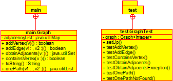

# BÚSQUEDA DE UN CAMINO EN UN GRAFO

## Breve descripción de la aplicación

* Resumen: Este proyecto implementa una estructura de datos de grafo en Java, con funciones para agregar vértices, arcos, obtener vértices adyacentes, comprobar la existencia de un vértice y encontrar un camino en dos vértices

* Versión: 1.0.

## USO DEL PROGRAMA
### Limpiar

```console
mvn clean
```

### Compilar

```console
mvn compile
```

### Javadoc

```console
mvn javadoc: javadoc
```

### Ejecutar Programa

```console
mvn test
```

## Estructura del código

Tal y como muestra la siguiente figura

.

Existen dos clases: `Graph.java`, en el paquete `main`, que contiene el método que realiza la simulación; y `GraphTest.java`, en el paquete `test`, que comprueba que el método ‘onePath(V v1, V v2)‘ encuentra un camino entre los vertices cuando existe.

## License

Este proyecto está bajo la [Licencia](LICENSE.txt).
